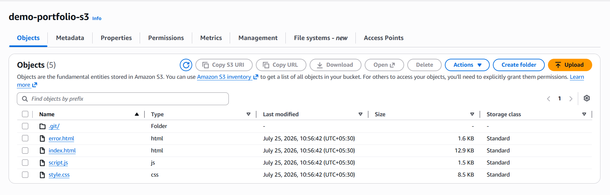
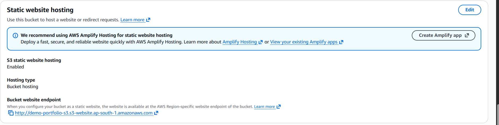

# 🪣 AWS S3 — Static Website Hosting


This project demonstrates how to host a **static website** using **Amazon S3** without provisioning or managing any servers.

By enabling **S3 Static Website Hosting**, uploading your website files, and configuring a public bucket policy, you can deploy a fully functional website in just a few minutes.

---

# 📖 Table of Contents

* [Overview](#-overview)
* [Architecture](#-images/Bucket.png)
* [Features](#-features)
* [Project Structure](#-project-structure)
* [Prerequisites](#-prerequisites)
* [Deployment Steps](#-deployment-steps)
* [Bucket Policy](#-bucket-policy)
* [Verification](#-verification)
* [Security Notes](#-security-notes)
* [Cleanup](#-cleanup)
* [Future Improvements](#-future-improvements)
* [AWS Services Used](#-aws-services-used)
* [Author](#-author)

---

# 📌 Overview

Amazon S3 is an object storage service that can also host static websites containing HTML, CSS, JavaScript, images, and other assets.

In this project, you'll learn how to:

* Create an S3 bucket
* Upload website files
* Enable Static Website Hosting
* Configure a bucket policy for public read access
* Deploy a static website without using EC2 or any web server

---

# 🏗️ Architecture

<p align="center">
  
</p>

---

# ✨ Features

* 🪣 Amazon S3 Static Website Hosting
* 📄 Custom `index.html`
* ⚠️ Custom `error.html`
* 📜 JavaScript Support
* 🌐 Public Website Endpoint
* 🔐 Read-only Bucket Policy
* 🚀 Serverless Website Hosting

---

# 📂 Project Structure

```text
AWS-S3-Static-Website/
│
├── index.html
├── error.html
├── script.js
├── README.md
└── images/
    └── s3-architecture.png
```

---

# 📋 Prerequisites

Before starting, make sure you have:

* AWS Account
* Basic HTML/CSS/JavaScript knowledge
* Website files (`index.html`, `error.html`, `script.js`)

---

# 🚀 Deployment Steps

## Step 1 — Create an S3 Bucket

Navigate to:

**AWS Console → S3 → Create Bucket**

Use the following configuration.

| Setting             | Value                                              |
| ------------------- | -------------------------------------------------- |
| Bucket Name         | Globally Unique (e.g., `my-static-site-demo-2026`) |
| Region              | Your Preferred AWS Region                          |
| Block Public Access | Disabled                                           |

> **Important:** To host a public static website, you must disable **Block All Public Access** and acknowledge the warning.

---

## Step 2 — Upload Website Files

Upload the following files to the bucket root.

```text
index.html
error.html
script.js
```

---

## Step 3 — Enable Static Website Hosting

Navigate to:

**Bucket → Properties → Static Website Hosting → Edit**

Enable Static Website Hosting and configure:

| Setting        | Value      |
| -------------- | ---------- |
| Index Document | index.html |
| Error Document | error.html |

Save the configuration.

AWS will generate a **Website Endpoint URL** similar to:

```text
http://your-bucket-name.s3-website-ap-south-1.amazonaws.com
```

---

## Step 4 — Configure Bucket Policy

Navigate to:

**Bucket → Permissions → Bucket Policy**

Replace `YOUR-BUCKET-NAME` with your actual bucket name.

```json
{
  "Version": "2012-10-17",
  "Statement": [
    {
      "Sid": "PublicReadGetObject",
      "Effect": "Allow",
      "Principal": "*",
      "Action": "s3:GetObject",
      "Resource": "arn:aws:s3:::YOUR-BUCKET-NAME/*"
    }
  ]
}
```

This policy grants **public read-only access** to all objects in the bucket.

---

# 🔍 Verification

Open the website endpoint generated by AWS.

Example:

```text
http://YOUR-BUCKET-NAME.s3-website-ap-south-1.amazonaws.com
```

<p align="center">
  
</p>


Verify the following:

* ✅ Homepage loads successfully.
* ✅ JavaScript executes correctly.
* ✅ Visiting a non-existent page displays the custom `error.html`.

---

# 🔐 Security Notes

* Only `s3:GetObject` permission is granted.
* Visitors cannot upload, modify, or delete files.
* Avoid storing confidential or sensitive files in a public bucket.
* S3 Website Endpoints support **HTTP only**.
* For HTTPS support, use **Amazon CloudFront** in front of the bucket.

---

# 📚 AWS Services Used

* Amazon S3
* IAM Bucket Policy
* Static Website Hosting

---

# 🚀 Future Improvements

You can extend this project by adding:

* Amazon CloudFront (HTTPS + CDN)
* Route 53 Custom Domain
* SSL Certificate using AWS Certificate Manager
* GitHub Actions for Automatic Deployment
* Versioning
* Lifecycle Rules
* CloudWatch Monitoring

---

# 🧹 Cleanup

To avoid unnecessary AWS charges:

1. Empty the S3 bucket.
2. Delete all uploaded objects.
3. Delete the S3 bucket.

---

# 👨‍💻 Author

**Ved Dandotia**

* 🌐 Portfolio: https://techxved.me
* 💼 LinkedIn: https://linkedin.com/in/ved-dandotia-b069a5329
* 🐙 GitHub: https://github.com/TechxVed

---

## ⭐ Support

If you found this project helpful, consider giving it a **⭐ Star** on GitHub. It helps others discover the project and motivates me to create more AWS, Cloud, and DevOps projects.

Happy Cloud Learning! ☁️🚀
